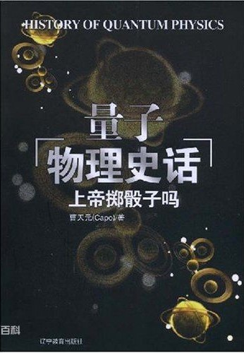
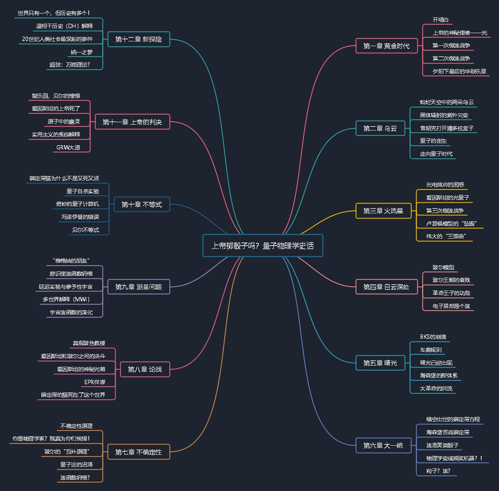
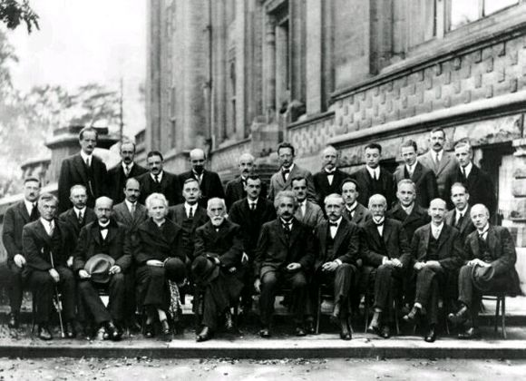
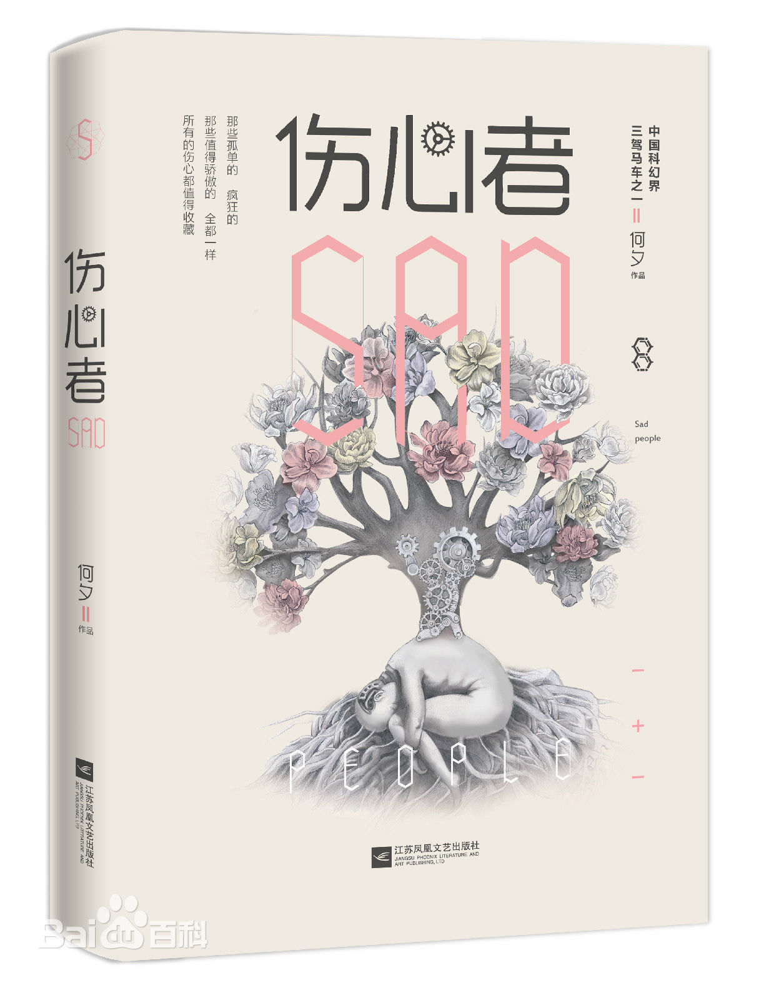

### 《上帝掷骰子吗？量子物理史话》阅读分享

&emsp;&emsp;一直以来大众对于物理学科普读物，第一印象还是霍金的几本著作，例如《时间简史》、《果壳中的宇宙》，但其实除了经典科普之外，在鱼龙混杂的“网络文学”之中，有时也会有惊才绝艳之作诞生。

&emsp;&emsp;例如这本《上帝掷骰子吗？量子物理史话》，自2004年在网络连载之后，十几年来被各大出版商多次再版，豆瓣评分9.2，还曾被刘慈欣称为“学生上课时最想偷看的物理小说”。(虽然刘大并没有官方确认这一说法~)

&emsp;&emsp;借用一位网友的书评：本书绝不仅仅是狭义意义上的科普书，它兼具科普、哲学、文学、传奇、探险故事、名人传记等多项功能，不同爱好的读者都可在书中找到自己感兴趣的东西。

&emsp;&emsp;从我个人角度，最初被吸引的还是作者展现出的将学术转换为通俗的强大能力，以及引人入胜的文笔，游刃有余地将枯燥的“物理理论”和“历史事件”巧妙融合成了一部具有强烈史诗感的著作，同时行文流畅诙谐，令人手不释卷。




>豆瓣读书 https://book.douban.com/subject/1467022/


&emsp;&emsp;没有过多介绍本书的作者曹天元，因为，真的找不到太多信息……据说是作者本人不愿透露过多个人资料，仅有的描述也只是他1981年生于上海，中学毕业后赴美国和中国香港读书，主攻专业为生物化学和电子工程，现居香港。

&emsp;&emsp;回到书籍本身，如果是科普读物的爱好者，会对书名有些眼熟，因为这是来源于爱因斯坦1926年写给波恩的信中的一句论断——“无论如何，我都确信，上帝不会掷骰子。” (爱因斯坦是决定论和因果论的支持者。) 同时也是由于霍金在《时间简史》中的一个完全相反的论断——“上帝不仅掷骰子，他有时候还会把骰子掷到我们看不到的地方。” —— 而被更多人所熟知。

&emsp;&emsp;本书全篇也正是贴合这一话题，带领读者走过从经典物理黄金时代，到光本性的微波战争，再到打开量子物理的潘多拉魔盒，从爱因斯坦和哥本哈根学派的论战，到量子论解释的百家争鸣，无数物理学家追求一生的“大一统”理论和两次超弦革命这些物理学史上影响深远的事件，犹如一幅徐徐展开的长篇画卷。

---



&emsp;&emsp;全书内容比较丰富（基本上等同于一部量子物理简史），因此挑几个有代表性的部分给大家介绍一下，再聊聊一路读来的感受。

---

**光本性的三次“微波战争”**

&emsp;&emsp;第一部分是物理学史上著名的三次“微波战争”，一场旷日持久的微粒说和波动说关于“光本性”的论战。全书以1887年赫兹著名的电磁波实验为开篇，缓缓揭开了十九世纪末经典物理学黄金时代的一角，讲述从法拉第到麦克斯韦再到赫兹，一个个如雷贯耳的名字如何铺就了光辉的电磁理论之路。紧接着书中的时光回到十七世纪中期，回顾导致“第一次微波战争”爆发的导火索——爱尔兰人波义耳在1663年提出的一个理论（颜色不是物体本身属性，是由于光照射产生的）。虽然该理论本身与光的微粒性和波动性没有关系，但是却引起了以胡克和惠更斯为首的波动说和以牛顿为首的微粒说的激烈争论。

&emsp;&emsp;胡克去世后第二年（1704）牛顿发表了煌煌巨著《光学》（不知道是不是故意等这个时间的~），并天才地运用高超的技巧解决了很多微粒说的难题，由于这时的牛顿已经是科学领域殿堂级的人物，顺理成章地带领微粒派摧枯拉朽般赢得了第一次“微波战争”的胜利。（胡克与牛顿也是一个既生瑜何生亮的故事，其实胡克对力学和光学的贡献远远超过大家所熟知的弹性定律）

&emsp;&emsp;时间又走过大半个世纪，1773年托马斯·杨出生于英国米尔沃顿，34年后，也就是距离牛顿的《光学》发表一个世纪后，托马斯·杨在他的《自然哲学讲义》中描述了那个名扬四海的实验：光的双缝干涉，同时也点燃了物理学史上第二次“微波战争”的导火索。

&emsp;&emsp;由于波动派双缝干涉实验的结果太难以反驳，以至于当时微粒派代表（比奥、拉普拉斯、泊松等）举办了一次竞赛（推导光线通过物体附近时的运动情况）来推动微粒说的发展。这时时间已经来到了1819年，第二次“微波战争”由于这场竞赛中的一个戏剧性的情况而决出了胜负——菲涅尔提交了一篇论文提出光是一种横波。评委会的泊松作为坚定的微粒派自然表示反对，因为经过计算后发现菲涅尔的理论会在圆盘衍射的阴影中形成一个光斑，泊松则认为这一结论十分荒谬。谁知在实验检测后，发现真的存在这样一个亮斑，反而印证了菲涅尔对光是横波的论断。这一理论给菲涅尔赢得了“物理光学之父”的称号，虽然这个光斑后来被称作“泊松亮斑”（略显讽刺）。

&emsp;&emsp;随后的大半个世纪里波动说没有给微粒说太多机会，因为经典电动力学的创始人麦克斯韦在1856、1861和1865发表的三篇电磁理论的论文预言了光是电磁波的一种，这一预言也在1887年被赫兹所证明，从而使波动说不仅统治了光领域，也站在了电磁理论的最高峰。

&emsp;&emsp;这一时期同样是经典物理学最为辉煌的阶段，牛顿的经典力学屹立不倒、光学与电磁学的统一、热力学三大定律已基本建立。十九世纪末的人们甚至开始倾向于认为物理学已经终结，所有的问题都可以用这个集大成的体系来解决。

&emsp;&emsp;但现实总是这样出人意料，亲手给电磁理论盖棺定论的赫兹也同样亲手埋下了量子的伏笔（光电效应，赫兹由于英年早逝没有来得及深入研究）。1900年开尔文在伦敦皇家研究所发表的演讲里，提到了物理学天空中的两朵乌云（这个说法现在几乎被所有物理史书籍引用，甚至比开尔文的绝对零度还出名）。这两朵乌云就是就是在迈克尔逊——莫雷实验和黑体辐射研究中的困境。第一朵乌云，最终导致了相对论革命的爆发；第二朵乌云，最终导致了量子论革命的爆发（这一朵乌云是本书讨论的重点）。

&emsp;&emsp;量子论也于同年开创，德国人普朗克在德国物理学会上发表了《黑体光谱中的能量分布》，随后打开了这一潘多拉魔盒。

&emsp;&emsp;普朗克之所以被称为量子力学创始人之一，是因为他在研究黑体辐射的普适公式时，创造性的提出了一个观点：

```
“能量在发射和吸收的时候，不是连续不断，而是分成一份一份的。”
```

&emsp;&emsp;这一观点直接挑战了自牛顿以来200多年，曾经被认为是坚固不可摧毁的经典物理世界。

&emsp;&emsp;乱世总是风云际会，二十世纪初的物理学界也是同样，就在普朗克宣告量子物理诞生的同年，阿尔伯特·爱因斯坦从大学毕业，尼尔斯·波尔在哥本哈根中学读书，埃尔文·薛定谔还在维也纳念高中，马克思·波恩刚进入大学，路易斯·德布罗意还在研究历史，沃尔夫冈·泡利刚刚出生，而海森堡和狄拉克也即将来到这个世界，整个量子物理史的所有重要角色都在这一时期汇集，不得不说在物理学界，这真的是一个时势造英雄的时代。

&emsp;&emsp;由于麦克斯韦伟大的电磁理论在光电效应上显得一头雾水，1905年瑞士的伯尔尼专利局里，一位26岁的小公务员发表了一篇名为《关于光的产生和转化的一个启发性观点》的论文，这篇论文不仅带给了他一个诺贝尔奖，同时也点燃了第三次“微波战争”的战火——这个小公务员自然就是后来载入物理学史册的阿尔伯特·爱因斯坦。爱因斯坦的光量子和康普顿在X射线研究中发现的康普顿效应，成为同时期微粒说的两面反攻的旗帜。但托马斯·杨的双缝干涉、菲尼尔的泊松亮斑，还有麦克斯韦预言的每秒30万公里的电磁波速度，都领波动说的地位不容撼动。作者也在这里给出了一个耐人寻味的评论：

```
“粒子还是波？在人类文明达到高峰的20世纪，却对宇宙中最古老的现象束手无策。”
```

&emsp;&emsp;这是一出300年来的传奇故事，其中悲欢起落，穿插着物理史上最伟大的那些名字：牛顿、胡克、惠更斯、杨、菲涅尔、傅科、麦克斯韦、赫兹、汤姆逊、爱因斯坦、康普顿、德布罗意……最终在1927年的科莫会议上，玻尔的“互补原理”站了出来，光没有所谓的本性，无论粒子还是波，这些属性都是同观察联系在一起的，“光本性”本身就是一个伪命题。

&emsp;&emsp;第三次“微波战争”就这样戏剧性的结束了，这一话题的终结者就是后来大名鼎鼎的“波粒二象性”。

---

**二十世纪最悲壮的论战——决定论的谢幕**

上传中... ...

&emsp;&emsp;

---

**两次“超弦革命”与大一统**

上传中... ...

&emsp;&emsp;

---

&emsp;&emsp;描述书中这几段量子物理史的经典时刻，主要是展示作者以历史小说的笔法呈现出来的物理学史独特的一面，娓娓道来同时又波澜壮阔。(原谅我拙劣的浓缩破坏了原书的意境，支持原著)

&emsp;&emsp;接下来也谈谈由此书带来的启发和思考。

&emsp;&emsp;首先就是基础理论的重要性。当今是一个技术爆炸的时代，也是一个资本膨胀的时代，速度、效率、收益这些词语似乎比年复一年进行基础实验有更大的吸引力。但很多人已经不记得，那个给电磁理论大厦封顶的青年——赫兹——英年早逝后的第三年，意大利的马可尼就基于电磁理论表演了无线电通讯，赫兹死后的第7年，无线电报已经可以穿越大西洋，一个崭新的“信息时代”由此而来。换句话说，今天我们引以为傲的信息化智能化生活，都是构建在百年前这些理论先驱的基石之上。而他们自己，或者说在他们生前的时代，谁又能想到这些理论如今会闪耀在世界的每一个角落？

&emsp;&emsp;不仅仅是物理学，数学领域更是如此。例如1858年剑桥数学家亚瑟·凯莱发明行列式的时候，谁能想到会在近一个世纪后被海森堡重新发明为矩阵，从而开创性的形成了矩阵力学，与薛定谔的波动力学共同成为了量子理论重要的体系之一；正如黎曼在创立黎曼几何的时候，也绝不会想到无意中给半个世纪后的爱因斯坦相对论提供了最好的工具。现在还有多少数学家们会穷毕生之力解决四色问题、费马大定律、哥德巴赫猜想？谁又能断言藏在这些问题背后的意义，不会带来另一次颠覆性的革命？正如量子力学在极小尺度上经典物理学的颠覆。

&emsp;&emsp;其实在这背后，隐藏的是很多超越时代的先驱者的悲哀。古希腊几何学家阿波罗尼乌斯总结了圆锥曲线理论，一千八百年后德国天文学家开普勒将其应用于行星轨道理论；高斯一生探索非欧几何的实际应用，抱憾而终，一百七十年后其发展而来的张量分析理论成为了广义相对论的核心基础。对于很多基础理论研究者，有生之年能将自己的学术价值展示在世人面前，已经是极大的幸运，更多的学者则是默默无闻的度过一生留下冰冷的论文与实验结果，静静的在某一处角落等待重现后世，或是永封尘埃。

---

**有趣的番外**

&emsp;&emsp;话题有些沉重，回到书籍本身。这本书不仅描述了很多史诗般的物理历史事件，同时也穿插了许多有趣的学术圈小故事，有些甚至可以称之为物理学“野史”。诸如胡克与牛顿之间的矛盾——牛顿到底是不是故意等到胡克去世后才发表微粒说的关键著作，“站在巨人的肩膀上”这句话是否是一句被误解的名言；阿拉果是怎样错过了与菲涅尔并肩站在经典物理光学顶峰的机会，虽然当初坚持验证泊松亮斑的其实是他；卢瑟福又是怎样获得“诺贝尔奖得主幼儿园”的称号，据统计他本人一生培养了至少10位诺贝尔奖得主，还不包括他本人；海森堡到底在德国原子弹的研究中扮演了怎样的角色，科学界的无间道还是一个低级的计算失误... ...

&emsp;&emsp;这些问题的答案大多已经湮没在物理学历史的长河之中，如果大家有兴趣可以支持正版，跟随作者再一次领略那个百花齐放的光辉年代。

&emsp;&emsp;实际上本书流传的有两个版本，一个是曹天元以笔名CAPO于2004年发布在网络上的版本，另一个是2006年由辽宁教育出版社出版的正式发行版。我在Kindle上购买的是正式版（有DRM版权保护），所以能分享给大家的是网络版（可以留言或私信）。其实从内容上来看，虽然正式版做了很多内容勘误，但也删减了一些网文诙谐的笔法和故事性，我个人更偏爱网络版~

&emsp;&emsp;本次分享已经抵达终点，但物理学的车轮依然会滚滚向前，远没有看到尽头。虽然霍金在《时间简史》中觉得：“我们可能已经接近于探索自然的终极定律的终点。”

&emsp;&emsp;但愿如此~也希望他在另一个世界可以继续探索宇宙的终极理论。

---

&emsp;&emsp;最后附一张1927年第五届索尔维会议的合影，摄于比利时布鲁塞尔，是一张著名的物理学界“全明星”之队的照片。其中29位与会者中有17人是诺贝尔奖得主，唯一的女性居里夫人得过两次诺贝尔奖。中国武林小说史上著名的华山论剑，也没有如此阵容。



&emsp;&emsp;第一排：欧文·朗缪尔、马克斯·普朗克、玛丽·居里、亨德里克·洛伦兹、阿尔伯特·爱因斯坦、保罗·朗之万、Ch. E. Guye、C.T.R.威尔逊、O.W.里查森 

&emsp;&emsp;第二排：彼得·德拜、马丁·努森、威廉·劳伦斯·布拉格、Hendrik Anthony Kramers、保罗·狄拉克、亚瑟·康普顿、路易·德布罗意、马克斯·波恩、尼尔斯·玻尔 

&emsp;&emsp;第三排：奥古斯特·皮卡尔德、E. Henriot、保罗·埃伦费斯特、Ed. Herzen、Théophile de Donder、埃尔温·薛定谔、E. Verschaffelt、沃尔夫冈·泡利、沃纳·海森堡、R.H.福勒、里昂·布里渊

&emsp;&emsp;以此纪念这个辉煌的黄金年代。

---

关于个人感悟，有些来源于早些年读到的《伤心者》，作者何夕，是可以与刘慈欣、王晋康并肩的中国科幻作家。

* 裂墙推荐此文，直至文末，方显笔力之锋，思想之深，合卷久久不能平静。
>豆瓣 https://book.douban.com/subject/26590999/



* 其他人写的较好的分享感悟
>简书 https://www.jianshu.com/p/61f6232f21ae
>有书快看（内容又些与原书不符） http://www.iqiyi.com/w_19s2cm86zt.html


